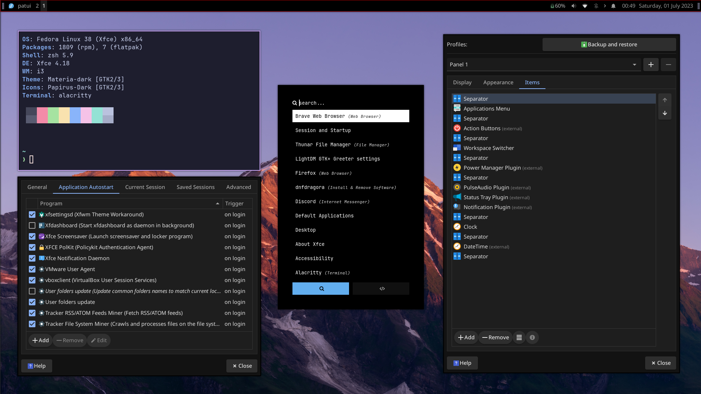
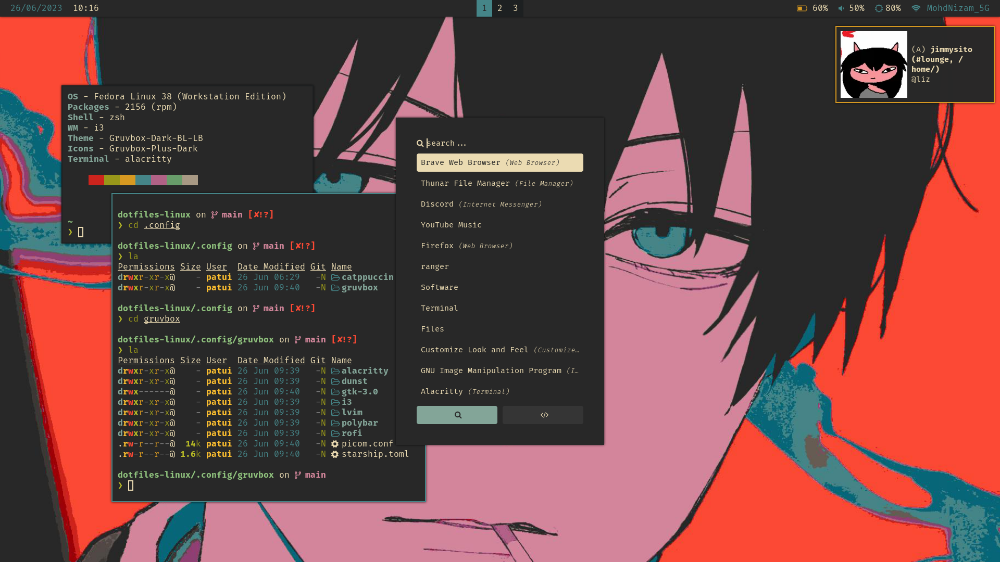
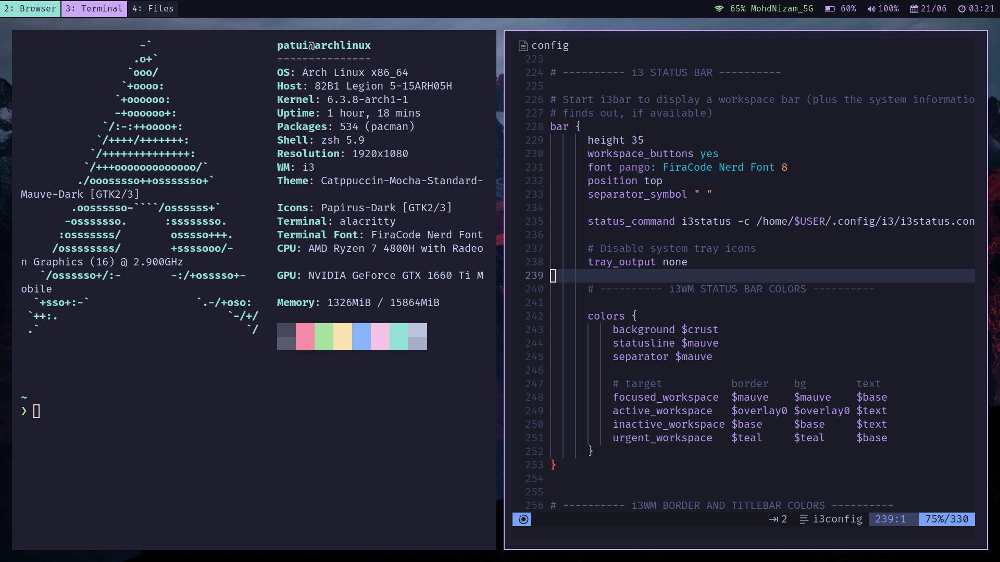

# dotfiles-linux
v3 xfce i3 (latest)  
[Click here to learn how to setup XFCE with i3](https://github.com/fathulfahmy/dotfiles-linux/blob/main/.config/v3-xfce-i3-latest/README.md)

- OS: Fedora 38 XFCE Spin
- WM: i3wm
- Bar: Xfce4 Panel
- Icon: Papirus
- Theme: Materia Theme
- Fonts: Noto Sans, JetBrainsMono Nerd Font
- Colorscheme: Catppuccin

v2 i3wm Gruvbox

  
- OS: Fedora 38 i3 Spin
- WM: i3wm
- Bar: Polybar
- Notification: Dunst
- Music Player: ncmpcpp + mpd
- Icon: Gruvbox Plus
- Theme: Gruvbox GTK Theme
- Fonts: Noto Sans, FiraCode Nerd Font
- Colorscheme: Gruvbox

v1 i3wm Catppuccin

  
- OS: Arch
- WM: i3wm
- Bar: i3 Status
- Icon: Papirus
- Theme: Catppuccin GTK Theme
- Fonts: Noto Sans, FiraCode Nerd Font
- Colorscheme: Catppuccin

